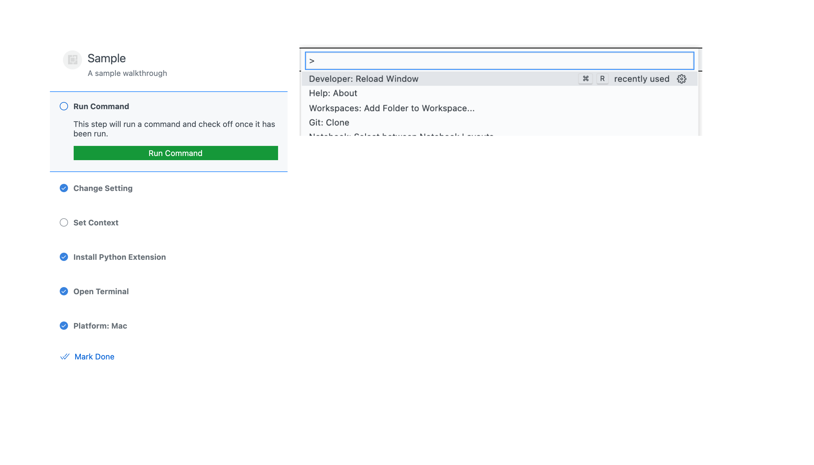

<<<<<<< HEAD
# getting-started-sample

This sample shows how to provide a walkthrough to the Getting Started section in vscode's welcome page.

This repository now includes a documentation site under `docs/`. Run `npm run docs:serve` and visit `http://localhost:8080` to preview the documentation UI.

=======
# Dashboard
>>>>>>> 669959215194630099bc08b4d8a323615e4e7282
